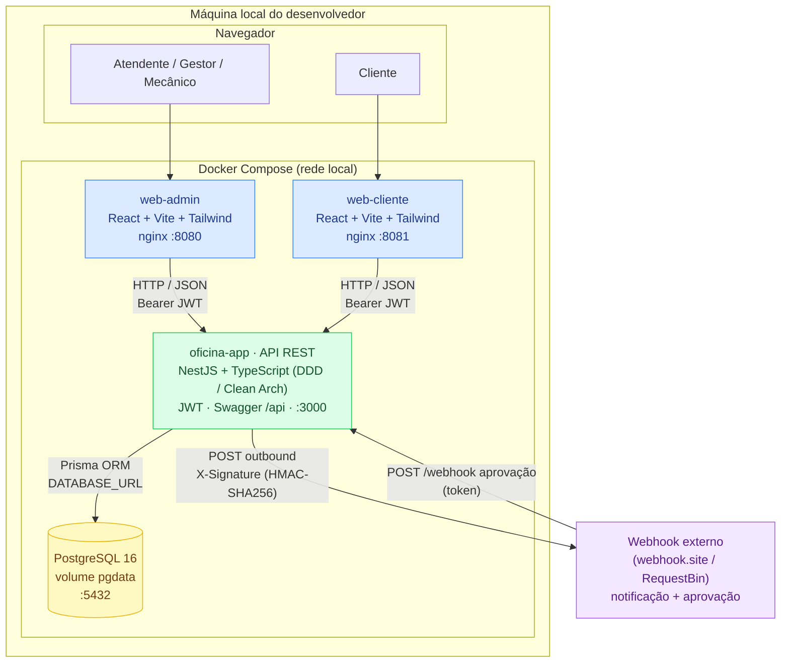
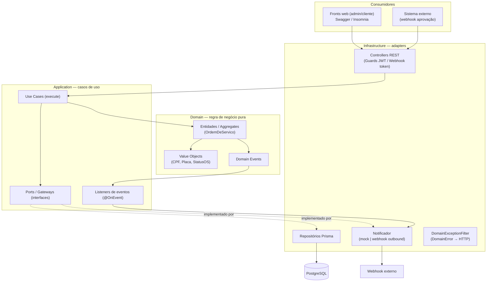
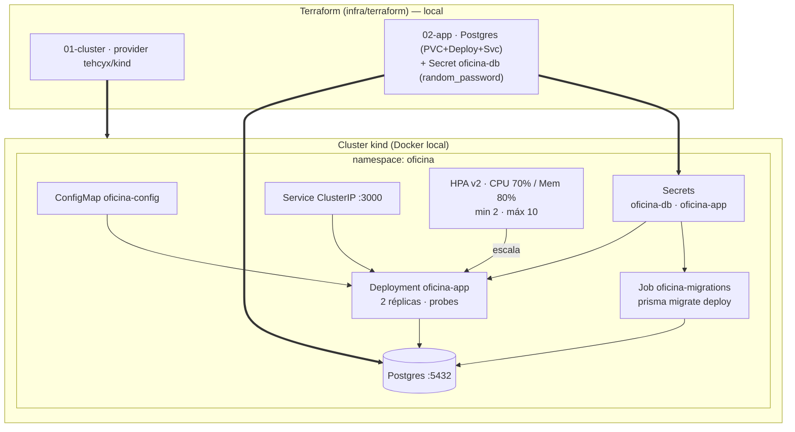

# Arquitetura da Solução — Execução 100% Local

Desenho da arquitetura da **Oficina Mecânica** conforme foi desenvolvida e
executada **100% localmente** (sem provisionamento em nuvem). O foco é mostrar os
**recursos escolhidos** e como os componentes se comunicam na máquina do
desenvolvedor via **Docker Compose** (runtime principal) e, opcionalmente, em um
**cluster Kubernetes local (`kind`)** provisionado por Terraform.

> Para o PDF de entrega, use as imagens renderizadas (uma por diagrama):
> [runtime local](./arquitetura-local-1.png) ·
> [componentes (Clean Arch/DDD)](./arquitetura-local-2.png) ·
> [Kubernetes local (kind)](./arquitetura-local-3.png).
>
> Para regenerá-las:
> `npx -p @mermaid-js/mermaid-cli mmdc -i docs/arquitetura/arquitetura-local.md -o docs/arquitetura/arquitetura-local.png -b white -s 3`

---

## 1. Visão geral — runtime local (Docker Compose)

Todos os componentes rodam como containers na máquina local, orquestrados pelo
`docker-compose.yml`. O único ator externo é um **webhook de terceiros**
(ex.: `webhook.site`) usado para demonstrar notificações e a aprovação de
orçamento — não há dependência de nuvem.

**Recursos escolhidos (runtime local):**

| Componente | Tecnologia | Porta local | Papel |
|---|---|---|---|
| Front Admin | React 18 + Vite + Tailwind (nginx) | `8080` | Painel para atendente/gestor/mecânico |
| Front Cliente | React 18 + Vite + Tailwind (nginx) | `8081` | Acompanhamento e aprovação pelo cliente |
| API | NestJS + TypeScript, DDD/Clean Architecture | `3000` | Regras de negócio, REST, JWT, Swagger |
| Banco | PostgreSQL 16 (volume `pgdata`) | `5432` | Persistência (ACID) via Prisma ORM |
| Orquestração | Docker Compose | — | Sobe todos os serviços e aplica migrations |
| Integração externa | Webhook HTTP (HMAC-SHA256) | — | Notificação de status + aprovação de orçamento |

---

## 2. Componentes da aplicação (Clean Architecture + DDD)

A API é um **monólito NestJS** organizado por **bounded contexts**, cada um em três
camadas com dependências apontando **para dentro** (Infra → Application → Domain).
O domínio não conhece framework nem ORM; a regra é garantida por teste
(`src/shared/architecture.spec.ts`).

**Bounded contexts:** `Atendimento` (Cliente, Veículo, OrdemDeServico — aggregate
root), `Catálogo` (Serviço), `Estoque` (Produto), `Autenticação` (Usuário/JWT) e
`Notificação`. A comunicação entre contextos usa *ports* read-only de
anti-corrupção.

---

## 3. Kubernetes local (opcional) — `kind` + Terraform

Além do Docker Compose, a solução pode ser implantada em um **cluster Kubernetes
local `kind`** (Kubernetes-in-Docker), provisionado por Terraform em dois estágios.
**Continua 100% local** — não há EKS/RDS nem qualquer recurso em nuvem.

> **CI/CD:** o pipeline `.github/workflows/ci-cd.yml` sobe um cluster `kind`
> **efêmero** no runner (testes → build → imagem → `terraform apply` →
> `kubectl apply -k k8s/` → smoke test em `/health`), provando o deploy
> ponta-a-ponta sem nuvem.
